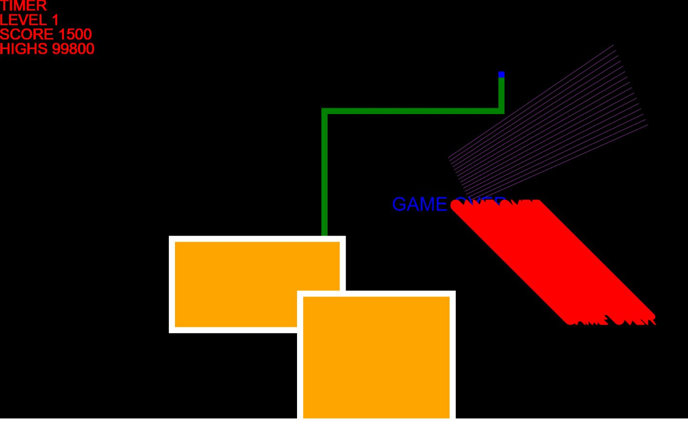

# Qix
Qix browser based javascript game with keyboard and gamepad controls

## Gamepad
Simply connect a Gamepad to USB port and use the directions to move and hold Button 1 to start capture an Area

## Keyboard controls
-Enter: Restart Game
-Arrows: Moves the Player
-Space: Hold space while moving to start capture an Area
-H: debug help

[Qix test] https://webhauser.github.io/Qix/

> [!WARNING]
> This game is under development and far from complete game.
